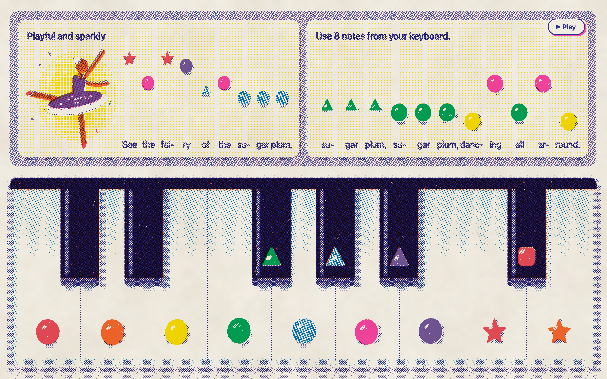
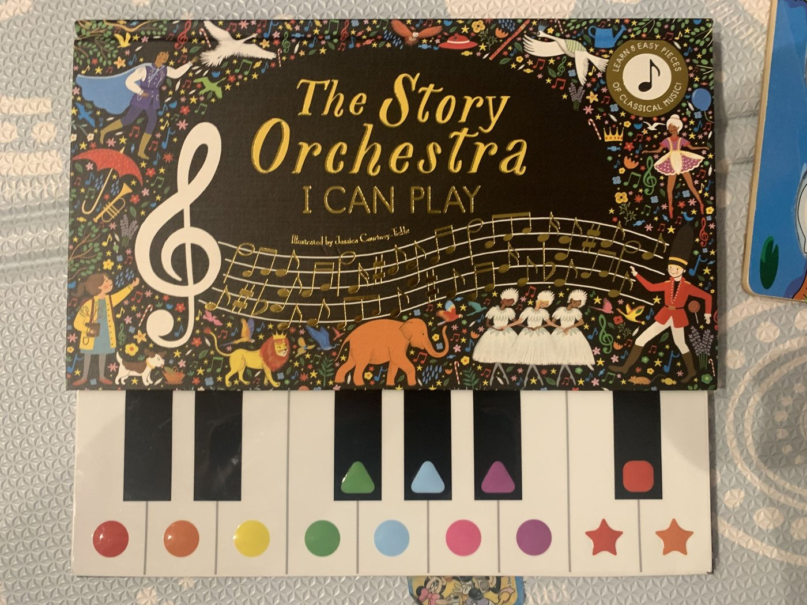
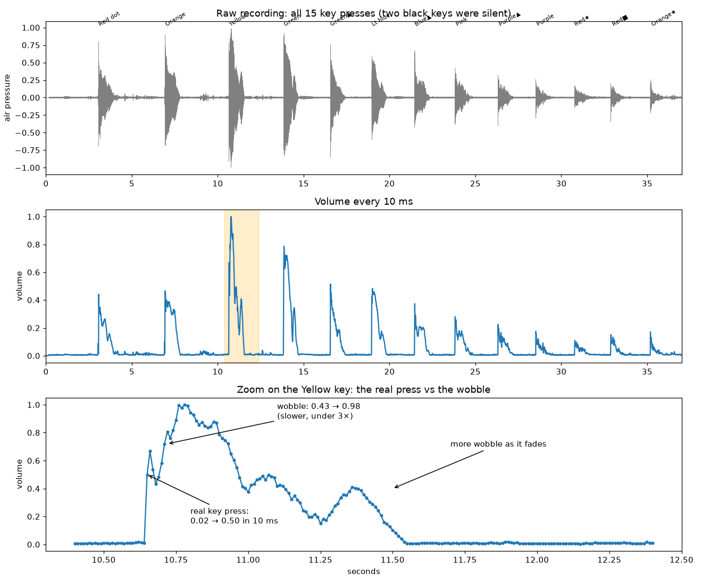
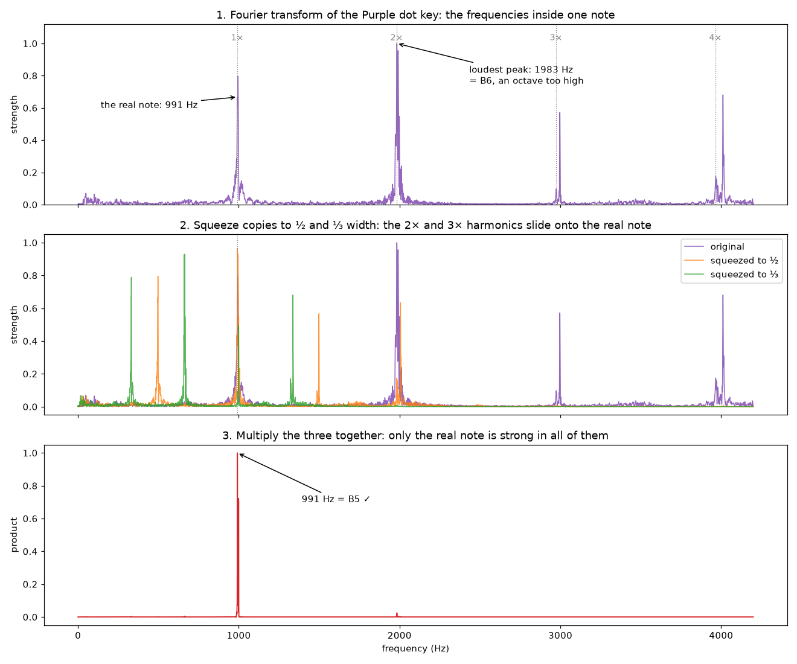
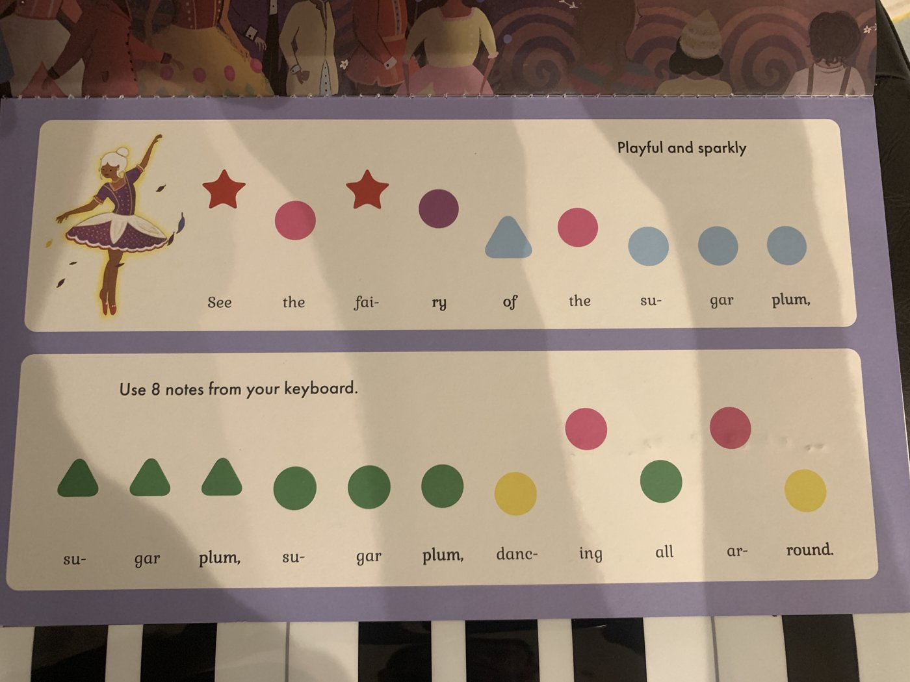

# The Dance of the Sugar Plum Fairy (Toy Piano Animation)

A risograph-style web rendition of based on 'The Story Orchestra' children's toy piano and its "Dance of the Sugar Plum Fairy" lesson page.
Click the keys to play them at the real toy's pitches, or press Play to hear the song from the intro to line 8 with each key animating in time.

Open `toy-piano-print.html` in a desktop browser to try it. There is nothing to install.

## How this was built

### The starting point

The toy is *The Story Orchestra: I Can Play*, a book with a 15-key keyboard attached. Each key has a coloured sticker, and each lesson page writes a tune as a row of those stickers. The toy's recording of each piece stops after about 30 seconds, and the goal was to find out whether the whole Sugar Plum Fairy could be played on it.

### Mapping the keyboard

The keys follow the normal piano pattern (C D E F G A B C D, with black keys in groups of two and three), but a photo can't tell you the octave, the tuning, or whether every key works. So we recorded the keys:

1. **Record.** The toy sat next to a MacBook and each of the 15 keys was pressed in order, about two seconds apart, while `ffmpeg` recorded the built-in microphone.
2. **Find each note.** The recording was split into 10 ms slices and the loudness of each measured. A key press is a sudden jump in volume. The toy's notes also wobble in volume as they ring (below), so a new note only counts when the volume jumps at least 3× within 30 ms.
3. **Measure the pitch.** A Fourier transform splits each note into the frequencies it contains. The toy's tone is buzzy, so its strongest frequency is sometimes a harmonic rather than the note itself. On the Purple dot and Orange star keys, the loudest peak is an octave too high. A *harmonic product spectrum* fixes that: the spectrum is multiplied by copies of itself squeezed to ½ and ⅓ width, and only the true note lines up in all three (below).
4. **Name the note.** With A4 = 440 Hz, the note number is `69 + 12 × log₂(Hz ÷ 440)`. The whole number gives the note name and octave, and the remainder gives how far out of tune it is in cents.

| Sticker | Note | Measured | Sticker | Note | Measured |
|---|---|---|---|---|---|
| Red dot | C5 | 527.6 Hz | Blue triangle | G#5 | 837.1 Hz |
| Plain black key | C#5 | silent | Pink dot | A5 | 886.9 Hz |
| Orange dot | D5 | 590.8 Hz | Purple triangle | A#5 | 939.4 Hz |
| Plain black key | D#5 | silent | Purple dot | B5 | 997.9 Hz |
| Yellow dot | E5 | 664.2 Hz | Red star | C6 | 1056.5 Hz |
| Green dot | F5 | 702.5 Hz | Red square | C#6 | 1115.7 Hz |
| Green triangle | F#5 | 744.2 Hz | Orange star | D6 | 1189.7 Hz |
| Light blue dot | G5 | 790.0 Hz | | | |

The toy covers C5 to D6, an octave above middle C, and every key is about 13 cents sharp. The two black keys without stickers are decoration: the recording shows a gap where they were pressed. That leaves 13 working notes.

### Matching the book to the score

The melody came from a MusicXML piano arrangement (`score/Dance_of_the_sugar_plum_fairy.mxl`). Reading the book's stickers as notes showed its two lines are bars 5 to 8 of the tune, moved up 5 semitones from E minor to A minor. Moving the rest of the piece by the same amount and checking each note against the 13 working keys gave:

- **The tune fits.** A few bars needed moving up or down an octave to stay on the keyboard. The one audible compromise is at the start of line 3, where the tune dips down instead of climbing, because the toy has no notes below C5.
- **The middle section doesn't.** Bars 21 to 37 are fast runs that go below and above the toy's range and need the two silent keys, so the rendition stops at line 8.

The arrangement was checked by ear with playback built from the toy's own recorded notes.

### The rendition

The page is one HTML file drawn with Canvas 2D, with no images, libraries or fonts to load. It follows the method in [sevenevesai/riso-windowseat](https://github.com/sevenevesai/riso-windowseat) to look like a risograph print:

- Every shape is drawn once per ink (yellow, orange, red, pink, green, blue, violet, indigo) as a layer where opacity means how much ink.
- Each layer is turned into halftone dots, with each ink's dot grid at its own angle, then tinted and multiplied onto cream paper. Each ink is shifted by a pixel or two, like plates that don't quite line up.
- There's no black ink. The black keys are indigo, violet and orange printed on top of each other.

The picture takes about a second to print, so key presses don't redraw it. Each key's pressed shading is printed once up front into a small overlay, and pressing a key fades that overlay in. A ring of ink dots bursts from the sticker when it sounds.

Autoplay uses a note list (start time, length, note) generated from the MusicXML at the score's tempo of 70 beats per minute, so the timing comes from the score rather than being typed in by hand. `audio/full_synth.wav` is the same arrangement rendered to audio.
